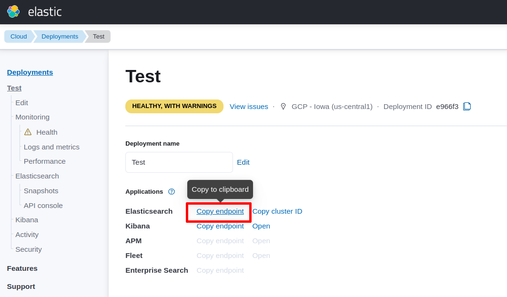

# Elasticsearch Perl client

[](https://github.com/elastic/elasticsearch-perl/actions)

Search::Elasticsearch is the official Perl API for Elasticsearch. 
The full documentation is available on https://metacpan.org/module/Search::Elasticsearch.

## Features

* Full support for all Elasticsearch APIs
* HTTP backend (blocking and asynchronous with [Search::Elasticsearch::Async](https://metacpan.org/module/Search::Elasticsearch::Async))
* Robust networking support which handles load balancing, failure detection and failover
* Good defaults
* Helper utilities for more complex operations, such as bulk indexing, scrolled searches and reindexing.
* Logging support via `Log::Any`
* Easy extensibility

## Install

```
cpanm Search::Elasticsearch
```

## Connecting to Elasticsearch

You can connect to Elasticsearch using the following examples:

```perl
use Search::Elasticsearch;

# Connect to localhost:9200 (default)
my $e = Search::Elasticsearch->new();

# Connect to http://search:9200
my $e = Search::Elasticsearch->new(
    nodes => [ 'search:9200' ]
);

# Round-robin between two nodes:
my $e = Search::Elasticsearch->new(
    nodes => [
        'search1:9200',
        'search2:9200'
    ]
);
```

After the connection you can start using the Elaticsearch endpoints
as functions of `$e` object, as follows:

```perl
# Info endpoint
my $result = $e->info(); 

printf("Name: %s\n", $result->{name}); # e.g. Name: instance-001
printf("Version: %s\n", $result->{version}->{number}); # e.g. Version: 8.5.2
```

## Connecting to Elastic Cloud

[Elastic Cloud](https://www.elastic.co/cloud/) is the cloud solution offered by Elastic. 

To connect the Perl client to Elastic Cloud you need the get the following data:

- the Elasticsearch server address (i.e. public URL);
- the Elastic Cloud API key;

You can retrieve these data from your Elastic Cloud dashboard. You need to open the
**Manage Deployments** page and **Copy endpoint of Elasticsearch** (see screenshot below).



This endpoint is the server address of Test instance (e.g. https://my-test.es.us-central1.gcp.cloud.es.io).

After this step, you need to generate an `API key` in the `Management` page under the section `Security`.


When you click on `Create API key` button you can choose a name and set the 
other options (for example, restrict privileges, expire after time, and so on).


After this step you will get the `API key`in the API keys page. 


**IMPORTANT**: you need to copy and store the `API key`in a secure place, since 
you will not be able to view it again in Elastic Cloud.

Finally, you can use the Elasticsearch endpoint and the API Key for connecting
the Perl client as follows:

```perl
my $e = Search::Elasticsearch->new(
    nodes => [ 'https://my-test.es.us-central1.gcp.cloud.es.io' ],
    elastic_cloud_api_key => 'insert here the API Key'
);
```

## Compatibility

Language clients are forward compatible; meaning that clients support communicating
with greater or equal minor versions of Elasticsearch. Elasticsearch language
clients are only backwards compatible with default distributions and without
guarantees made.

## License

This software is licensed under the [Apache 2 license](LICENSE).

